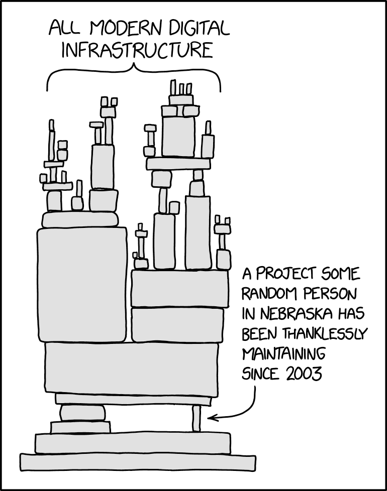
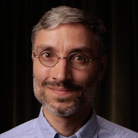
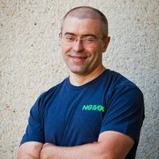
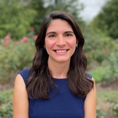

# Open Source Endowment

The [Open Source Endowment][ose] aims to solve the [open source sustainability crisis][chad-oss-sustainability] by
providing maintainers of critical open source software with a source of funding that is sustainable, systemic and
scalable.

| 🌱 Sustainable                                                                             | 🔗 Systemic                                                                                                         | 🚀 Scalable                                                                                              |
| -                                                                                          | -                                                                                                                   | -                                                                                                        |
| Ensures long-term, predictable cash flow, independent of economic and political volatility | Prioritizes critical yet underfunded open source packages, rather than large/popular ones or specific supply chains | Operates as an efficient next-gen charity designed for scale, not a like a typical non-profit foundation |

  <a href="comparison.md">Comparison to existing solutions</a>
  &nbsp;&nbsp;•&nbsp;&nbsp;
  <a href="faq.md">FAQ</a>
  &nbsp;&nbsp;•&nbsp;&nbsp;
  <a href="roadmap.md">Roadmap</a>
  &nbsp;&nbsp;•&nbsp;&nbsp;
  <a href="https://github.com/osendowment/foundation/issues/2">Grant model discussion</a>
  &nbsp;&nbsp;•&nbsp;&nbsp;
  <a href="acts-of-incorporation">Acts of incorporation</a>

## The problem

We all rely on open source software. But open source software is facing [a crisis][chad-oss-sustainability]. Around
[86%][ossra] of the maintainers that keep OSS going don't get paid, but do their open source work as a second shift
after their day job. This leads to maintainer burnout, which not only harms maintainers, but also companies, since
[96%][harvard] of codebases use open source software. When open source libraries are not properly maintained, we get
catastrophic global security issues, such as [Heartbleed][heartbleed], [Log4Shell][log4shell] and the [XZ Utils
backdoor][xz].

We must take steps to make the open source ecosystem we all rely on more sustainable. This means securing sustainable
funding for maintainers. This hasn't happened until now.

## Our solution

OSE's solution uses the [endowment model][endowment-wiki] to secure sustainable funding for maintainers. Here's how it
works:

1. **Fundraising** 
  The Open Source Endowment Foundation raises money from individual donors.
1. **Investments** 
  This money is used to buy assets such as stocks and other securities, via licensed low-risk US-based asset managers.
  These assets provide a yearly return — hopefully between 5% and 7%.
1. **Selection** 
  We identify underfunded critical open source projects, and select grantees among their maintainers, using an algorithm
  developed in-house. Part of the money the Foundation makes from its assets every year is distributed to grantees.
1. **Monitoring** 
  We ask our grantees to tell us what impact our grants have had on their projects, so that we can understand how to
  better make future grants, and to monitor the impact OSE has on the open source ecosystem.

Our long-term goals:

* The maintainers of the most critical 10,000 open source projects are sustainably funded.
* The Open Source Endowment is the charity of choice for the tech industry.

## Principles

* **📊 Data-driven allocation** 
  Our grants will be allocated based on an algorithm that is open source, iteratively improved [in consultation with the
  community][grant-model-issue], and based on data from across the open source ecosystem.
* **⚖️ Neutrality and decentralisation** 
  We have an inclusive, community-oriented governance system, where members have a say in most decisions.
  We accept passionate individuals, not corporations, as members, to prevent the influence of corporate interests.
* **🔎 Radical transparency** 
  We recognise that community members are able to make valuable contributions only when they are empowered with all of
  the information they need. Most OSE-related discussions are discussed in the open in [our GitHub
  issues][foundation-issues], and anyone is welcome to contribute.
* **🌍 Global outlook** 
  OSE supports the entire global open source ecosystem, not just specific countries or regions.

## Governance

* **Members** 
  Donors who give 1000 USD or more qualify as members. Members advise the board on strategic matters, such as the grant
  selection algorithm, and in the future will also nominate board members.
* **Board members** 
  A board made up of individuals (as opposed to corporations) reports to donors, selects assets managers and designs
  grant processes, among other duties.

Our core team is made up of board members and the executive director (who are all also OSE members), as well as
experienced advisors that the board consults with.

* [**Konstantin Vinogradov**](https://www.linkedin.com/in/kvinogradov/) (Board Member, Chairman)
  * General Partner at VC firm [Runa Capital][runacap] ($0.5B+ AUM), where he focuses on early-stage investing in OSS &
    dev-focused startups
  * Co-founded a next-gen endowment providing UBI for students at a top STEM university, which grew from $50K to $600K+
    raised from 150+ donors in 8 countries
  * Has been publishing the [ROSS Index][rossx], a data-driven rating of top open-source startups, every quarter since
    2020

* [**Chad Whitacre**](https://www.linkedin.com/in/chadwhitacre/) (Board Member, Secretary)
  * Head of Open Source at [Sentry][sentry], the leading developer-first application monitoring platform ($3B+
    valuation)
  * Leader of the [Open Source Pledge][osp], a fast-growing cultural initiative to get companies to pay the open source
    maintainers that they depend on
  * Founder of open source funding pioneer [Gratipay][gratipay] (2012–2018)

* [**Maxim Konovalov**](https://www.linkedin.com/in/maxim/) (Board Member, Treasurer)
  * Co-founder and ex VP Engineering at [Nginx][nginx], the world's leading web server, acquired for ~$0.7B in 2019
  * Former VP Engineering at [F5][f5]. Seasoned supporter of [FreeBSD][freebsd]

* [**Jonathan Starr**](https://www.linkedin.com/in/jonathan-starr-b04032284/) (Executive Director)
  * Program Manager at [NumFOCUS][numfocus], a nonprofit foundation supporting OSS used for science and research
    (e.g. [Pandas][pandas] and [NumPy][numpy])
  * Co-Founder of [SciOS][scios], a collaborative organization focusing on sustainable open source for the scientific
    community

* [**Amy Parker**](https://www.linkedin.com/in/amy3parker/) (Advisor)
  * Chief Fundraising Officer at [OpenSSL][openssl]
  * Former Director of the [Wikipedia Endowment][wiki-endow]
  * Former Director of Individual Giving at the [Smithsonian][smithsonian] and the [New York Public Library][nypl]

* [**Vlad-Stefan Harbuz**](https://vlad.website) (Advisor)
  * Maintainer of the [Open Source Pledge][osp]
  * Core developer of OSS funding service [thanks.dev][thanksd]
  * PhD researcher in philosophy of economics at the [University of Edinburgh][uoe-vlad]
  * Contributor to software used by the [Gates Foundation][gates] to allocate $1B in healthcare funding

OSE currently has over 20 co-founding donors (“members”) who have committed to donating 1000 USD or more. All board
members and the executive director are also members and have skin in the game.

## Membership

There are two routes to becoming a member:

* **Cash Membership** — Give 1000 USD or more to qualify for membership and gain the ability to participate in decisions
  taken collectively by OSE members. After making your payment, contact us at [donors@endowment.dev][donor-contact] and
  share a few words about yourself, so that we can include you on our member list (unless you'd prefer to be anonymous).
* **In-Kind Membership** — Have you contributed significant labour to OSE, and prefer not to make a cash contribution?
  [Open a GitHub issue][foundation-issues] to request in-kind membership. The OSE board will review and decide on these
  requests, and community discussion is welcome.

## Donate to the Open Source Endowment

Concerned that the modern world depends on open source software that's maintained unsustainably? Join us in funding a
solution. Know that, by donating any amount, you are contributing to the global sustainability of open source software.

* USD wire from a US/global bank to our account (Mercury Bank, no fees)
  - Beneficiary Name: Open Source Endowment Foundation
  - Beneficiary Address: 1209 Orange Street, Wilmington, DE 19801
  - Type of Account: Checking
  - Account Number / IBAN: 202527873980
  - ABA Routing Number: 091311229
  - SWIFT / BIC Code: CHFGUS44021
  - Bank Name: Choice Financial Group Bank
  - Address: 4501 23rd Avenue S, Fargo, ND 58104
* Card payments
  - [Stripe][dono-stripe] (2.9% fees)
  - [PayPal][dono-paypal] (4.9% fees)
* Donation platforms
  - [GitHub Sponsors][dono-gh] (6% fee = 3% card processing + 3% GitHub)
  - [Ko-Fi][dono-kofi]
  - [Buy me a coffee][dono-bmac]

[apache-foundation]: https://www.apache.org/
[chad-oss-sustainability]: https://openpath.quest/2024/the-open-source-sustainability-crisis/
[dono-bmac]: https://buymeacoffee.com/osendowment
[dono-gh]: https://github.com/sponsors/osendowment
[dono-kofi]: https://ko-fi.com/osendowment
[dono-paypal]: https://www.paypal.com/donate/?hosted_button_id=JBYBVSHCC9U8N
[dono-stripe]: https://buy.stripe.com/4gwdTs9zk0VI7F67ss
[donor-contact]: mailto:donors@endowment.dev
[ecosystems]: https://ecosyste.ms
[endowment-wiki]: https://en.wikipedia.org/wiki/Financial_endowment
[f5]: https://www.f5.com/
[foundation-issues]: https://github.com/osendowment/foundation/issues
[foundation]: https://github.com/osendowment/foundation
[freebsd]: https://www.freebsd.org/
[gates]: https://www.gatesfoundation.org/
[gh-sponsors]: https://github.com/sponsors
[gh]: https://github.com
[grant-model-issue]: https://github.com/osendowment/foundation/issues/2
[gratipay]: https://gratipay.com/
[harvard]: https://www.hbs.edu/ris/Publication%20Files/24-038_51f8444f-502c-4139-8bf2-56eb4b65c58a.pdf
[heartbleed]: https://en.wikipedia.org/wiki/Heartbleed
[landing-page-issues]: https://github.com/osendowment/landing-page/issues
[landing-page]: https://github.com/osendowment/landing-page
[linux-foundation]: https://www.linuxfoundation.org/
[log4shell]: https://en.wikipedia.org/wiki/Log4Shell
[mariadb]: https://mariadb.org/
[mastra]: https://mastra.ai/
[n8n]: https://n8n.io/
[nginx]: https://nginx.org/
[numfocus]: https://numfocus.org/
[numpy]: https://numpy.org/
[nypl]: https://www.nypl.org/
[opencollective]: https://opencollective.com/
[openssl]: https://openssl-foundation.org/
[ose]: https://endowment.dev/
[osp]: https://opensourcepledge.com
[ossra]: https://www.blackduck.com/resources/analyst-reports/open-source-security-risk-analysis.html
[pandas]: https://pandas.pydata.org/
[polar]: https://polar.sh
[rossx]: https://runacap.com/ross-index/
[runacap]: https://runacap.com/
[scios]: https://www.scios.tech/
[sentry]: https://sentry.io/
[smithsonian]: https://www.si.edu/
[sovtech]: https://www.sovereign.tech/
[thanksd]: https://thanks.dev
[twenty]: https://twenty.com/
[uoe-vlad]: https://edwebprofiles.ed.ac.uk/profile/vladh
[wiki-endow]: https://wikimediaendowment.org/
[xz]: https://en.wikipedia.org/wiki/XZ_Utils_backdoor
